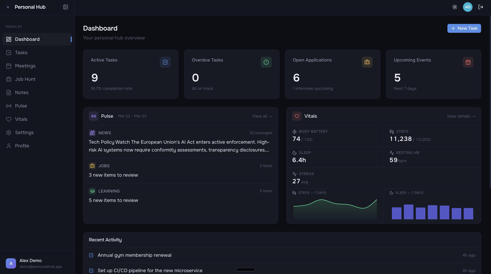
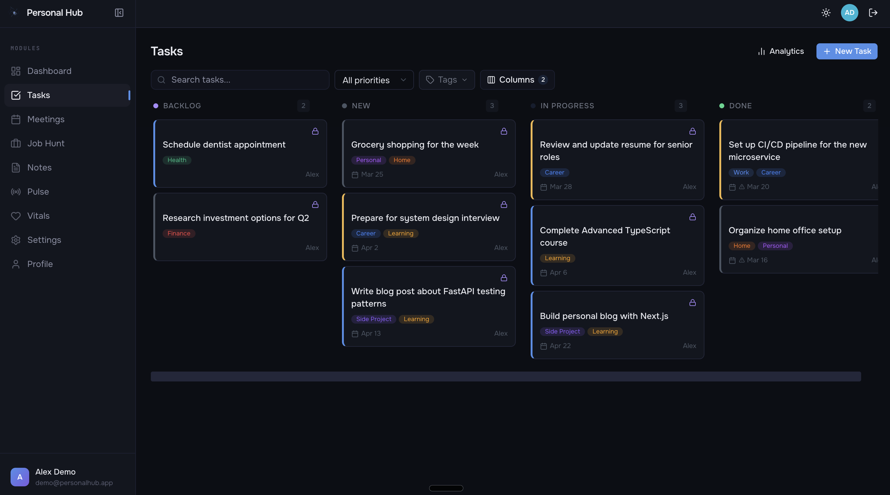
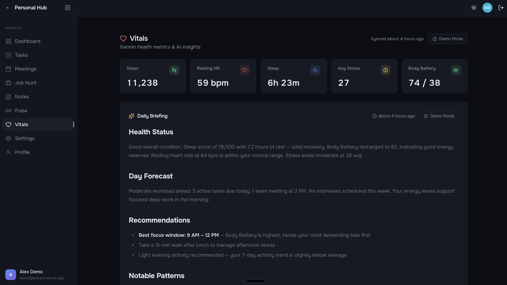
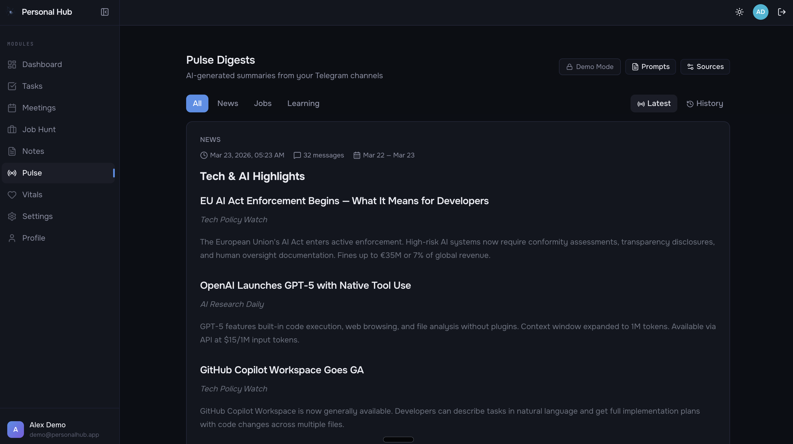
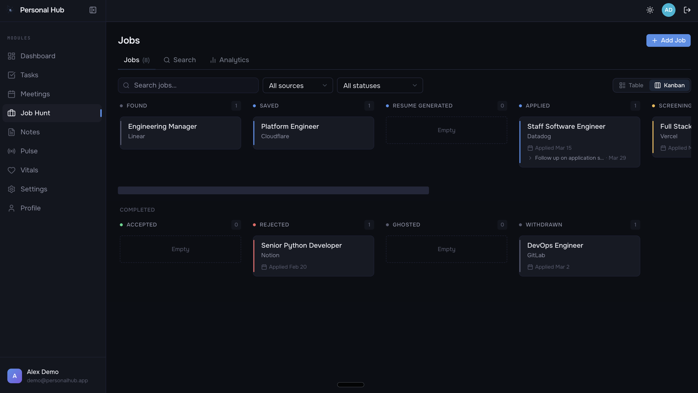
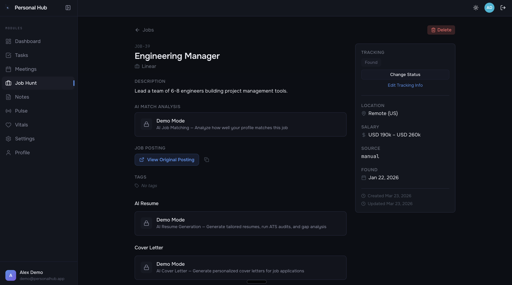
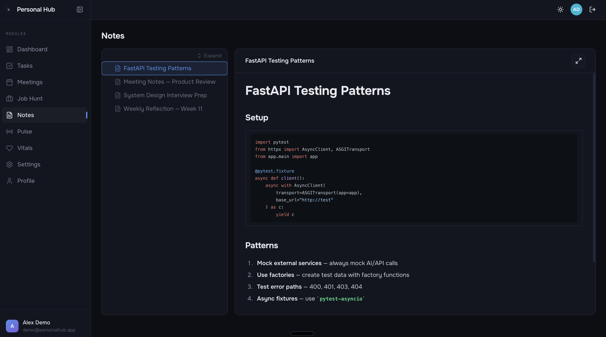
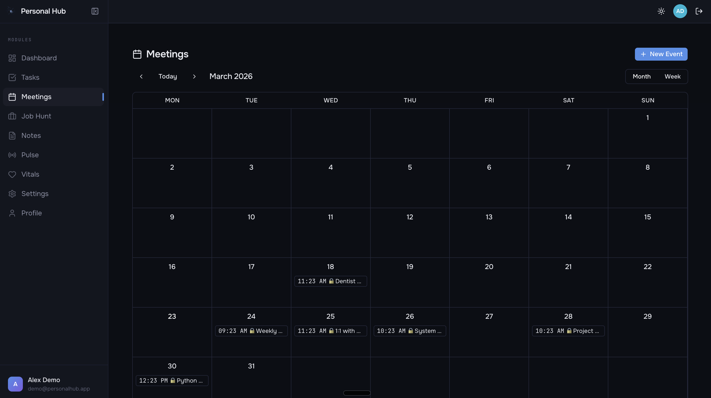
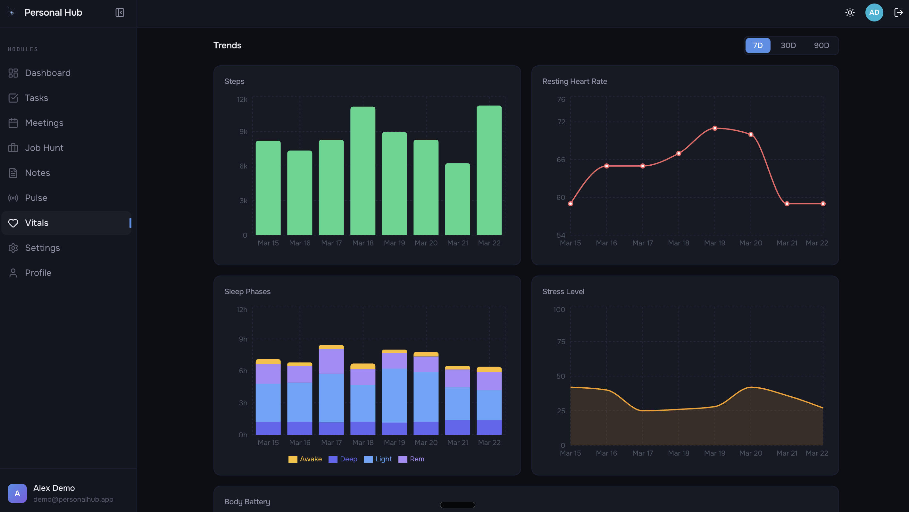

# My Personal Hub

A full-stack personal productivity platform that consolidates task management, job hunting, calendar, notes, Telegram monitoring, and health tracking into a single dashboard.

**[Live Demo](https://hub.dmitrii-vasichev.com)**

### Dashboard


### Task Manager


### Vitals — Health Metrics & AI Briefing


### Pulse — AI-Generated Telegram Digests


<details>
<summary>More screenshots</summary>

### Job Hunt — Kanban Board


### Job Hunt — Detail View with AI Tools


### Notes — Markdown Editor


### Meetings — Calendar View


### Vitals — Trend Charts


</details>

## Features

- **Task Manager** — Kanban board with drag-and-drop, priorities, reminders, analytics, and backlog
- **Job Hunt Tracker** — Table & Kanban views, AI-powered job matching, cover letter generation, resume management
- **Calendar** — Google Calendar integration, event-task-note linking
- **Notes** — Google Drive sync, Markdown rendering, cross-entity linking (tasks, jobs, events)
- **Telegram Pulse** — Monitor Telegram channels, AI-generated digests, learning inbox with structured items
- **Vitals** — Garmin health metrics sync, AI daily briefings, trend charts
- **Dashboard** — Centralized overview with widgets for all modules
- **Tags** — Cross-entity tagging system with multi-tag filtering
- **Demo Mode** — Built-in demo role with seed data for showcasing
- **User Management** — Role-based access control, visibility settings

## Tech Stack

| Layer | Technology |
|-------|-----------|
| Frontend | Next.js 16, React 19, TypeScript, Tailwind CSS, shadcn/ui |
| Backend | FastAPI, Python 3.12, SQLAlchemy, Alembic |
| Database | PostgreSQL (async via asyncpg) |
| AI | OpenAI, Anthropic, Google Gemini |
| Integrations | Google Calendar, Google Drive, Telegram (MTProto + Bot API), Garmin Connect |
| Testing | Pytest (backend), Vitest + React Testing Library (frontend) |
| Deploy | Vercel (frontend), Railway (backend + PostgreSQL) |

## Architecture

```
┌─────────────────────────────────────────────────┐
│                   Frontend                       │
│         Next.js · React · Tailwind · shadcn/ui   │
│                  (Vercel)                        │
└──────────────────────┬──────────────────────────┘
                       │ REST API
┌──────────────────────▼──────────────────────────┐
│                   Backend                        │
│       FastAPI · SQLAlchemy · Alembic · AI        │
│                  (Railway)                       │
├──────────────┬───────────┬──────────────────────┤
│  PostgreSQL  │  External │  AI Providers         │
│  (asyncpg)   │  APIs     │  OpenAI / Anthropic / │
│              │  Google   │  Gemini               │
│              │  Telegram │                       │
│              │  Garmin   │                       │
└──────────────┴───────────┴──────────────────────┘
```

## Local Development

### Prerequisites

- Node.js 20+, Python 3.12+, PostgreSQL

### Backend

```bash
cd backend
python -m venv venv && source venv/bin/activate
pip install -r requirements.txt
cp ../.env.example .env   # edit DATABASE_URL and secrets
alembic upgrade head
uvicorn app.main:app --reload
```

### Frontend

```bash
cd frontend
npm install
cp ../.env.example .env.local  # set NEXT_PUBLIC_API_URL=http://localhost:8000
npm run dev
```

### Docker

```bash
docker compose up
```

### Running Tests

```bash
# Backend
cd backend && pytest

# Frontend
cd frontend && npm test
```

## Deployment

### Backend → Railway

1. Create a Railway project with a PostgreSQL service.
2. Connect the repo (root directory: `backend/`).
3. Set environment variables (see `.env.example`):
   - `DATABASE_URL` — provided by Railway PostgreSQL plugin
   - `JWT_SECRET_KEY` — generate a strong random secret
   - `CORS_ORIGINS` — your Vercel frontend URL
   - `APP_ENV=production`
4. Railway uses `railway.toml` for build/start commands automatically.

Health check: `GET /api/health`

### Frontend → Vercel

1. Import the repo (root directory: `frontend/`).
2. Set `NEXT_PUBLIC_API_URL` to your Railway backend URL.
3. API rewrites are configured in `next.config.ts`.

### Environment Variables

See [`.env.example`](.env.example) for all required variables and descriptions.

## Project Structure

```
├── backend/
│   ├── app/
│   │   ├── api/          # FastAPI route handlers
│   │   ├── models/       # SQLAlchemy models
│   │   ├── schemas/      # Pydantic schemas
│   │   ├── services/     # Business logic
│   │   └── core/         # Config, security, middleware
│   ├── alembic/          # Database migrations
│   └── tests/            # Pytest test suite
├── frontend/
│   ├── src/
│   │   ├── app/          # Next.js pages & layouts
│   │   ├── components/   # React components
│   │   ├── hooks/        # Custom React hooks
│   │   ├── lib/          # API client, utilities
│   │   └── types/        # TypeScript type definitions
│   └── __tests__/        # Vitest test suite
└── docs/                 # PRDs and implementation plans
```

## What I Learned

### Multi-Provider LLM Abstraction

Supporting three AI providers (OpenAI, Anthropic, Gemini) required a clean adapter pattern. Each provider has a different SDK and calling convention — Gemini's library is synchronous, Anthropic requires explicit `max_tokens`, OpenAI uses a different message format. The solution: a `LLMAdapter` protocol with a single `generate(system_prompt, user_prompt)` method and a factory function that returns the right adapter. API keys are Fernet-encrypted at rest and decrypted only at call time. This lets users switch providers in settings without any business logic changes.

### Telegram: MTProto + Bot API Dual Approach

Reading messages from Telegram channels requires the MTProto protocol (via Telethon) — the Bot API only allows bots to read channels where they are admins. But sending notifications to users is cleaner through a bot. So the system uses both: Telethon connects as the user's account to collect channel history, while python-telegram-bot sends digest notifications. Telethon sessions are encrypted and stored in the database, restored on each polling cycle, and the polling schedule is managed by APScheduler.

### Garmin Connect Reverse-Engineering

Garmin has no public API. The project uses the `garminconnect` library, which reverse-engineers Garmin's web endpoints. The main challenge is undocumented rate limits — Garmin returns HTTP 429 with no `Retry-After` header. The solution is an exponential backoff circuit breaker: on a 429, the system sets a cooldown (15 → 30 → 60 → 120 min cap), aborts all remaining API calls immediately, and skips sync entirely until the cooldown expires. Successful syncs reset the counter. Every sync attempt is logged to a `sync_log` table for observability.

### Demo Mode with Role-Based Data Isolation

Demo mode operates at three layers. In the database, every query checks `user.role` — demo users see only their own data, admins see everything except demo data. At the API level, a `restrict_demo` dependency blocks demo users from triggering external services (AI generation, Google Calendar sync). In the frontend, an `isDemo` flag from auth context swaps action buttons for informational badges. The demo account is seeded by an idempotent script that creates realistic data across all modules (tasks, jobs, calendar, notes, Telegram sources, health metrics) and can be fully reset via a single endpoint.

### React Query Polling Strategies

Different features need different update strategies. Task reminders and the dashboard use automatic 60-second polling via `refetchInterval`. Telegram message collection uses a manual polling pattern: the user clicks "Poll Now", which triggers a server-side job, then a 2-second client-side status poll tracks progress with a 5-minute timeout and automatic cleanup. Garmin sync uses event-driven invalidation — no polling, just cache invalidation after a manual or scheduled sync completes. React Query's default `refetchOnWindowFocus` handles tab-switching for all queries.

## License

[MIT](LICENSE)
